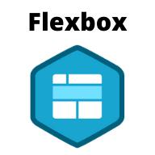

# Validation Password Form

<br>

## 🎥 Preview site :arrow_right: [tap here](http://szymonrojek.github.io/validation-password-JS/)

<br>
<br>


<br>
<br>

## Description:

---

<br>

Password Validation Form has got some restrictions:

- minimum one upperCase letter
- minimum one of the special characters: @#!
- minimum one number
- the elength between 5 and 12 characters

If password doesn't have a one of the rule the error occurs on the screen.

I have written pure functions and objects. There is also a possibility of assessing whether the password is weak or good or strong enough.

<br>

## Technologies:

---

<br>
<br>

<table>
  <tr>
    <td></td>
    <td></td>
    <td></td>
    <td></td>
  </tr>
</table>
<table>
  <tr>
    <td></td>
    <td> </td>
    <td></td>
  </tr>
 </table>

<br>

## I have used:

<br>

---

- Semantic HTML
- BEM methodology
- Functional Programming (mostly pure functions)

<br>

## Usage:

---

<br>

1. Install project:

```
npm install to have dev dependencies installed.
```

2. To start development and server for live preview

```
npm run dev
```

3. Build version

```
npm run build
```

4. Dist version - gh-pages

```
npm run deploy
```
